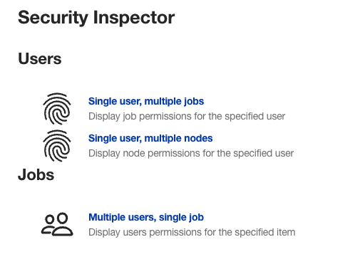
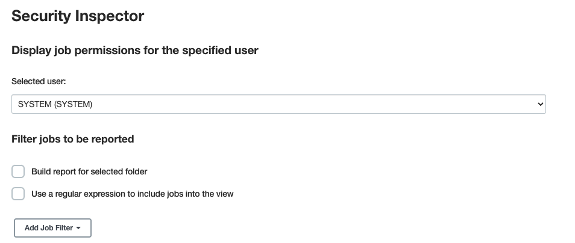
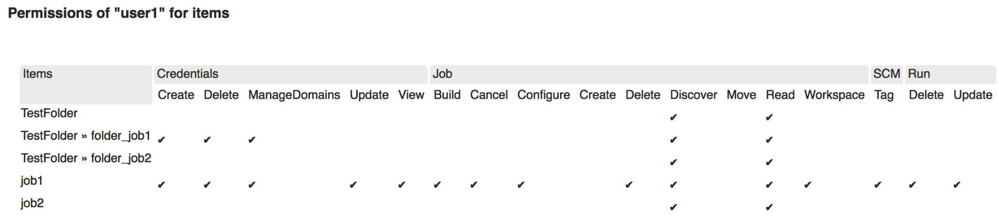

Security Inspector Plugin
====

This project is a [Jenkins](https://jenkins.io) plugin, which allows checking user permissions
for particular jobs and nodes.
The plugin can create various reports upon the request by Jenkins administrators.

### Usage

In order to use the plugin functionality, you should have the global `Jenkins.ADMINISTER` permission.
Once you get it...

1. Go to the `Manage Jenkins > Security Inspector` page.

1. Select the report you want to create and click the hyperlink.
1. Specify additional parameters (filters, etc.) in the opened page.

1. Click `Submit`.

### Available reports

Now this plugin can created 3 reports:

**For selected user:**
* Single user, multiple jobs.
 * Display job permissions for the specified user.
 * Items for the report can be selected using regular expressions or additional filters (e.g. JobFilter extension point).
* Single user, multiple nodes.
 * Display node permissions for the specified user.
 * Nodes for the report can be selected using regular expressions.

**For selected job:**
* Multiple users, single job.
 * Display users permissions for the specified item.
 * Users for the report can be selected using regular expressions.

### License

[MIT License](https://opensource.org/licenses/mit-license.php)

### Reporting issues

Use the main Jenkins bugtracker.
All issues should use the `security-inspector-plugin` component.
The issue reporting guide is available [here](https://wiki.jenkins-ci.org/display/JENKINS/How+to+report+an+issue).

### Contributing

* Create pull requests on GitHub
* New reports can be also created in external plugins.
There is a `ReportBuilder` extension point for it.
